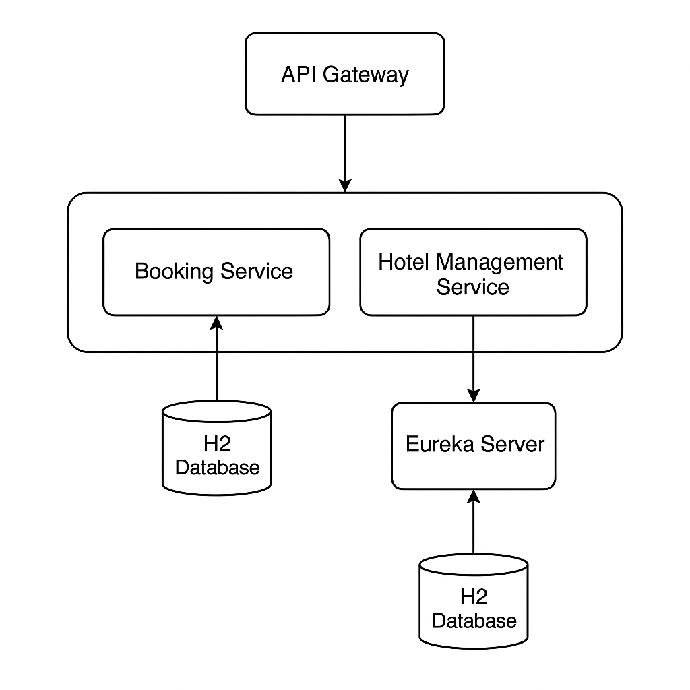

🏨 Hotel Booking System — Developer Documentation

📘 Описание проекта

Hotel Booking System — учебная микросервисная система бронирования отелей.
Проект реализован с использованием Spring Boot 3.5 и Spring Cloud, демонстрирует распределённую архитектуру, аутентификацию JWT и двухшаговую согласованность при бронированиях.

⸻

🧩 Архитектура системы

Компоненты:
1.	Eureka Server — сервис регистрации и обнаружения.
2.	API Gateway (Spring Cloud Gateway) — маршрутизация и прокси авторизации.
3.	Hotel Management Service — CRUD отелей и номеров, рекомендации по загрузке.
4.	Booking Service — регистрация, авторизация пользователей, бронирования и согласованность.

⸻

🧭 Архитектурная схема

⸻

🧱 Структура проекта

hotel-booking/
│
├── api-gateway/
│   └── application.yml
│
├── booking-service/
│   ├── controller/
│   ├── service/
│   ├── entity/
│   ├── repository/
│   ├── security/
│   └── application.yml
│
├── hotel-service/
│   ├── controller/
│   ├── service/
│   ├── entity/
│   ├── repository/
│   ├── config/
│   ├── filter/
│   └── application.yml
│
├── eureka-server/
│   └── application.yml
│
├── pom.xml
└── README.md

⸻

🧠 ADR — ключевые архитектурные решения

ADR-1	JWT как механизм авторизации	Простая и безопасная схема для микросервисов, каждый сервис — Resource Server
ADR-2	Spring Cloud Gateway вместо Zuul	Современный, реактивный шлюз, поддерживает JWT и маршрутизацию без блокировки
ADR-3	Eureka Service Discovery	Позволяет сервисам автоматически находить друг друга, без ручной конфигурации адресов
ADR-4	Согласованность через двухшаговый commit	Глобальные транзакции не используются, каждая операция — локальная, с компенсацией
ADR-5	H2 In-memory DB	Упрощает тестирование и CI/CD, без внешних зависимостей
ADR-6	Swagger + OpenAPI	Документация и тестирование REST API прямо из браузера
ADR-7	MapStruct + Lombok	Чистый код без boilerplate в DTO и мапперах

⸻

⚙️ Как запустить проект
1.	Собери проект:

mvn clean install

2.	Запусти микросервисы в порядке:

# 1. Eureka
cd eureka-server && mvn spring-boot:run

# 2. Hotel
cd ../hotel-service && mvn spring-boot:run

# 3. Booking
cd ../booking-service && mvn spring-boot:run

# 4. Gateway
cd ../api-gateway && mvn spring-boot:run

	3.	Проверь Eureka Dashboard:
👉 http://localhost:8761

⸻

🔐 Безопасность

JWT токен создаётся при регистрации/авторизации пользователя в Booking Service.
Каждый микросервис проверяет токен независимо.

Права доступа:

Роль	Доступ
USER	Просмотр отелей, создание бронирований
ADMIN	CRUD для отелей, номеров и пользователей

⸻

📡 Основные эндпойнты

Сервис	Метод	Путь	Описание
Booking	POST	/user/register	Регистрация (JWT)
POST	/user/auth	Авторизация
POST	/api/bookings	Создать бронирование
GET	/api/bookings	История бронирований
Hotel	GET	/api/hotels	Все отели
POST	/api/hotels	Добавить отель (ADMIN)
GET	/api/rooms/recommend	Рекомендации по загрузке
POST	/api/rooms/{id}/confirm-availability	Подтвердить доступность (internal)

⸻

🧪 Тестирование
•	Юнит-тесты: JUnit 5
•	Интеграционные тесты: MockMvc

Пример запуска:

mvn test

⸻

📖 Swagger-документация

Сервис	Swagger URL
Booking Service	http://localhost:8082/swagger-ui/index.html
Hotel Service	http://localhost:8081/swagger-ui/index.html

⸻

👩‍💻 Автор

Valeria Lee
Проект: Hotel Booking System
